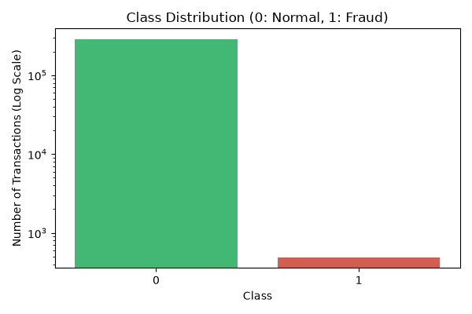
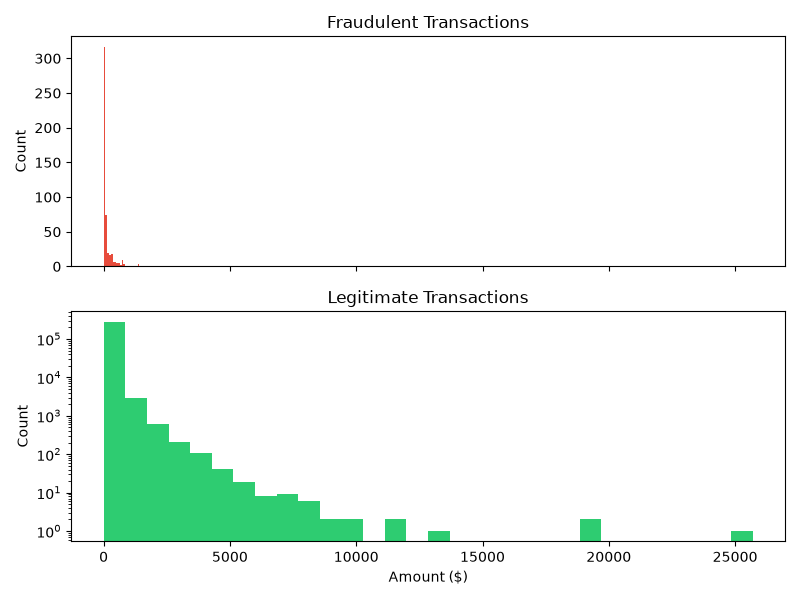

# Credit Card Fraud Detection
An end-to-end Machine Learning pipeline addressing severe class imbalance (0.17% fraud rate) to detect fraudulent financial transactions.

## Pipeline Architecture
1. *Robust Scaling*: Scaled raw Amount and Time features to minimize outlier impact.
2. *Class Imbalance Handling: Applied Synthetic Minority Over-sampling Technique (SMOTE*) exclusively on training splits to prevent data leakage.
3. *Modeling*: Trained a Logistic Regression classifier optimized for high recall.
4. *Performance: Achieved **92% Recall* on fraudulent transactions across an unseen test partition of 56,962 samples.
5. ## Exploratory Analysis
| Class Imbalance | Transaction Amount Distribution |
| :---: | :---: |
|  |  |

## Setup & Execution
```bash
python -m venv venv
source venv/Scripts/activate  # On Windows
pip install -r requirements.txt
python fraud_detection.py
